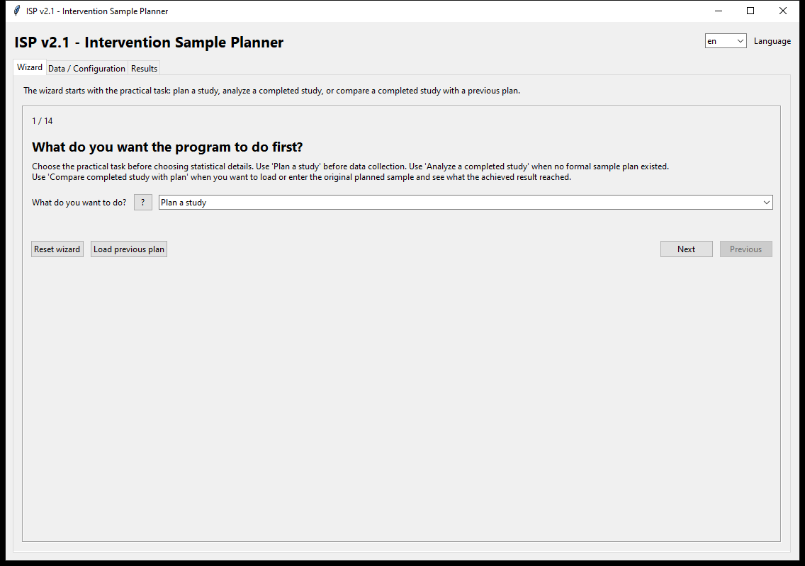
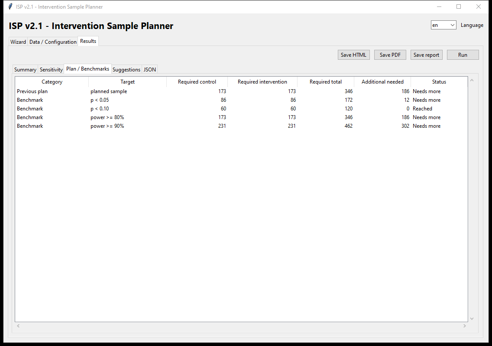

<!-- File version: 2.1; date: 2026-05-12 -->

# Intervention Sample Planner

O Intervention Sample Planner, ou `ISP`, é uma API local em Python com duas interfaces: um aplicativo desktop em Tkinter e um aplicativo web em Flask para planejar ou avaliar estudos de intervenção em processos humanos, como aprendizagem, treinamento, usabilidade e melhoria de fluxos de trabalho.

A versão `2.1` oferece:

- `Dois grupos independentes`
- `Pré-teste/pós-teste com grupo de controle`
- `Pré-teste/pós-teste com um grupo`
- `Planejar amostra necessária`
- `Avaliar resultado alcançado`
- três escolhas logo no início: planejar um estudo, analisar um estudo realizado ou comparar um estudo realizado com um plano anterior
- carregamento de um plano JSON salvo no fluxo de comparação com estudo realizado
- faixas recomendadas com liberação explícita
- explicações carregadas de um arquivo JSON separado
- uma aba de sugestões com orientações metodológicas e alertas
- uma tabela própria `Plano / Benchmarks` para verificações de estudo realizado
- exportação direta de relatório em texto, HTML ou PDF pelo aplicativo
- avaliação exata de McNemar para desfechos binários pareados em um grupo
- valores-p exatos de Fisher para resultados binários de dois grupos com amostras pequenas ou células esparsas
- notas mais claras sobre aproximação no espírito de ANCOVA em pré-teste/pós-teste com controle e sobre desenho com clusters
- endpoints REST para cálculo e exportação de relatórios
- uma interface no navegador preparada para deploy no Render sem banco de dados e sem etapa de build com Node.js

## Capturas de tela





## O que ele faz

O aplicativo ajuda a responder perguntas como:

- Quantos participantes válidos são necessários para comparar intervenção e controle?
- Quantas pessoas precisam completar tanto o pré-teste quanto o pós-teste?
- Quantas pessoas devem ser convidadas se parte delas não iniciar ou não terminar?
- Se um estudo já foi executado, que valor-p aproximado e que poder alcançado correspondem ao resultado observado?

A implementação atual é mais forte para planejamento transparente e interpretação educativa. O planejamento binário é suportado em `Dois grupos independentes`; a avaliação binária de estudo realizado é suportada em `Dois grupos independentes` e em casos pareados de pré/pós com um grupo.

## Caminhos de pesquisa típicos

### 1. Dois grupos independentes

Use quando um grupo recebe a intervenção e outro grupo não recebe. Exemplo: um pesquisador da área de jogos educacionais quer testar se usar Uno junto com uma aula melhora o entendimento de maior e menor em um pós-teste, comparado com apenas aula.

### 2. Pré-teste/pós-teste com grupo de controle

Use quando os dois grupos são medidos antes e depois. Exemplo: um grupo faz um pré-teste, joga Uno, recebe uma aula curta e faz um pós-teste; o grupo controle faz o mesmo pré-teste e pós-teste, mas recebe apenas a aula.

### 3. Pré-teste/pós-teste com um grupo

Use quando os mesmos participantes são medidos antes e depois e não existe grupo de controle. Exemplo: um pesquisador quer uma primeira estimativa do efeito de aprendizagem de jogar Uno entre um pré-teste e um pós-teste antes de executar um ensaio controlado.

## Fluxos de estudo realizado e problema inverso

`Analisar um estudo realizado` e `Comparar estudo realizado com o plano` são os fluxos inversos. Em vez de perguntar quantos participantes são necessários, eles perguntam o que a amostra alcançada e o efeito observado implicam. Eles relatam quantidades aproximadas como:

- efeito observado informado
- taxas binárias observadas quando as contagens de eventos são informadas
- estatística z aproximada
- valor-p aproximado
- poder alcançado aproximado
- lacunas para benchmarks convencionais como `p < 0.05`, `p < 0.10`, `power >= 80%` e `power >= 90%`

Se existir um plano anterior, use `Comparar estudo realizado com o plano`. Você pode digitar a amostra planejada manualmente ou clicar em `Carregar plano anterior` e escolher um JSON salvo de uma execução de planejamento. O relatório então informa se a amostra válida alcançada atingiu o plano e quantos participantes válidos ficaram faltando.

## Tamanho de efeito em linguagem simples

Tamanho de efeito é a entrada mais difícil para muitos usuários, então o `ISP v2.1` trata esse ponto explicitamente.

- Em `Dois grupos independentes`, o tamanho de efeito contínuo é a diferença padronizada entre grupos.
- Em `Pré-teste/pós-teste com grupo de controle`, ele é a diferença padronizada de ganho, ou o efeito no pós-teste depois de considerar a linha de base.
- Em `Pré-teste/pós-teste com um grupo`, ele é a mudança média padronizada nos mesmos participantes.

Valores tradicionais como `0,2`, `0,5` e `0,8` podem servir como orientação, mas o melhor tamanho de efeito é o menor efeito que realmente seria significativo no estudo real.

## Explicações e recomendações

O aplicativo lê explicações longas das variáveis e faixas recomendadas a partir de:

[explanations.json](intervention_sample_planner/explanations.json)

Esse JSON foi pensado para permanecer alinhado ao manual operacional e ao manual educacional.

## Execução local

```powershell
cd D:\GitHub\InterventionSamplePlanner
python -m unittest discover -s tests
python run_app.py
```

## Execução local da interface web

```powershell
python -m pip install -r requirements.txt
python -m flask --app intervention_sample_planner.web_app run
```

Depois abra `http://127.0.0.1:5000`.

## Construção do executável

Veja:

- [build_pt.md](build_pt.md)
- [developers_pt.md](developers_pt.md)
- [versions_pt.md](versions_pt.md)
- [docs/render_deploy_pt.md](docs/render_deploy_pt.md)

O checksum SHA256 do executável de release fica em `release/checksums.sha256`.

## Documentação principal

- [theoryintroduction_pt.md](theoryintroduction_pt.md)
- [manual.tex](docs/educational_manual/manual.tex)
- [useofAI_pt.md](useofAI_pt.md)
- [disclaimer_pt.md](disclaimer_pt.md)
